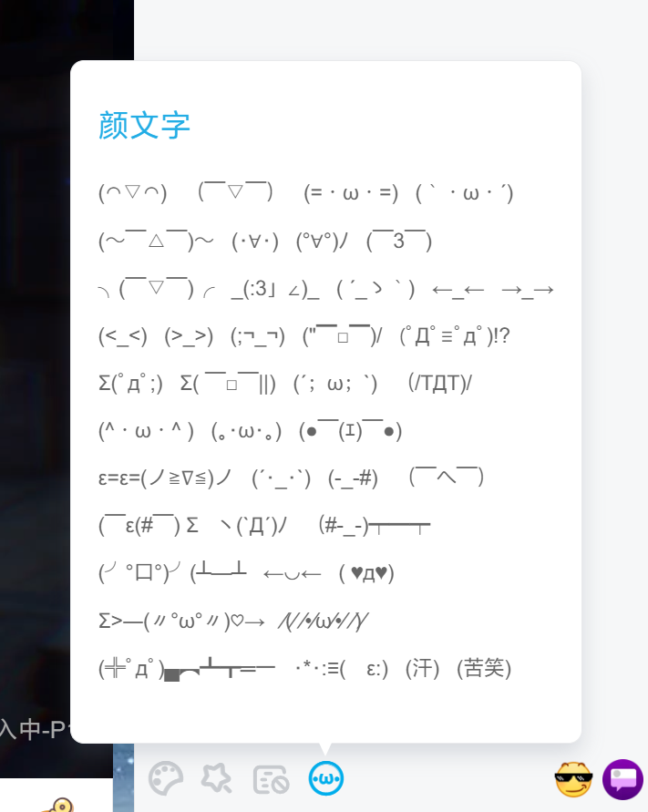

# bililive-kaomoji: bilibili 直播颜文字扩展

这是一个浏览器扩展插件，帮你找回被阿 b 砍掉的颜文字面板。

## 浏览器兼容性

支持 Chrome/Edge/Vivaldi 等使用 Chromium 内核的浏览器。

QQ/搜狗/360 等基于 Chromium 的国产浏览器理论上也能支持，但我没测试过。

能打开 `chrome://extensions` 页面而且能找到**开发者模式**选项应该就能安装（大概）。

## 安装

1. 从最新的 [Release 页面](https://github.com/ankoww/bililive-kaomoji/releases/latest)下载 zip 文件
2. 浏览器访问扩展页面 `chrome://extensions`，在顶部或左侧菜单中启用**开发者模式**（Developer mode）
3. 将下载的 zip 文件拖放到浏览器扩展页面，完成安装
4. 刷新已经打开的直播间页面即可生效

## 截图

## License

MIT
